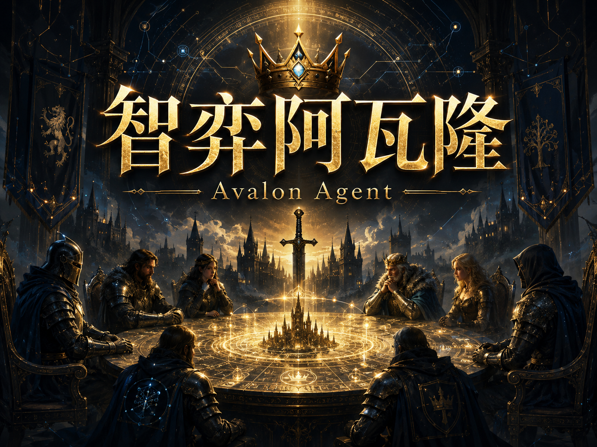

# 🏰 Avalon Agent · 5–10 Player Game (1 Human + Several AIs)

A runnable Avalon board-game program built on **LangGraph as its core agent framework**. You can pick a **5–10 player game** at the start, where 1 human player and several autonomous AI agents play together, with all special roles included. Each AI player is an autonomous agent equipped with **private memory + LLM reasoning + structured actions**, and its "perceive → reason → act" loop is modeled with a **LangGraph StateGraph**.



---

## 1. Project Design Notes

- **Backend**: Python standard-library `http.server`, which centrally manages game state, role assignment, and rule validation, and drives all agents. A state machine drives the whole game flow; after each human action, all AIs are automatically advanced until a human is needed again or the game ends.
- **Agent layer (core)**: Each AI = one `AvalonAgent`, whose **perceive → reason → act** loop is modeled with a **LangGraph StateGraph** (nodes: `perceive` renders context → `reason` calls the LLM → `act` validates / falls back / persists; branches that need no reasoning are short-circuited by `perceive`). It renders "public information (including the full transcript of speeches) + its own legal private information" into context, then produces structured decisions via LangChain `ChatOpenAI` (an OpenAI-compatible interface) in the form of **JSON Schema / tools**, and maintains private memory notes across turns. See [agent.py](agent.py) / [llm.py](llm.py) for details.
- **Frontend**: Native HTML + CSS + JavaScript. It polls `GET /api/state` to render, and submits human actions through the REST interface.
- **Information isolation (carried all the way down to the LLM layer)**: The true roles of all players exist only in the backend. Each player / each agent holds only its own `knowledge` (the information the rules allow it to know). **An agent's system prompt injects only its own legal secrets**, never anyone else's identity; an agent's private reasoning stays on the server and is never sent down. `GET /api/state` returns only public information + the human's own legal private information, and **never discloses anyone else's identity before the game ends**.

## 2. Game Rules and Role Setup (5–10 Player Game)

A popup at the start lets you choose the number of players (5–10). Different player counts use the following standard good/evil setups (definitions in [roles.py](roles.py) `ROLE_SETUPS`):

| Players | Good Setup | Evil Setup |
|---|---|---|
| 5 | Merlin · Percival · Loyal Servant ×1 | Assassin · Morgana |
| 6 | Merlin · Percival · Loyal Servant ×2 | Assassin · Morgana |
| 7 | Merlin · Percival · Loyal Servant ×2 | Assassin · Morgana · Oberon |
| 8 | Merlin · Percival · Loyal Servant ×3 | Assassin · Morgana · Mordred |
| 9 | Merlin · Percival · Loyal Servant ×4 | Assassin · Morgana · Mordred |
| 10 | Merlin · Percival · Loyal Servant ×4 | Assassin · Morgana · Mordred · Oberon |

**Roles and Known Information**

| Role | Faction | Known Information |
|---|---|---|
| Merlin | Good | Sees the evil players (**except Mordred**, without specific identities) |
| Percival | Good | Sees Merlin and Morgana as two "Merlin candidates," but cannot tell them apart |
| Loyal Servant | Good | No extra information |
| Assassin | Evil | Mutually known with Morgana/Mordred (excluding Oberon); responsible for the final assassination |
| Morgana | Evil | Mutually known with the Assassin/Mordred; appears as Merlin to Percival |
| Mordred | Evil | Mutually known with the Assassin/Morgana; **Merlin cannot see him**, so he can boldly pose as good |
| Oberon | Evil | Does not know his teammates, and his teammates do not know him |

**Mission Setup** (number of players sent per round / number of fail votes needed to lose; definitions in [game.py](game.py) `MISSION_CONFIG`)

| Players | Round 1 | Round 2 | Round 3 | Round 4 | Round 5 |
|---|---|---|---|---|---|
| 5 | 2 | 3 | 2 | 3 | 3 |
| 6 | 2 | 3 | 4 | 3 | 4 |
| 7 | 2 | 3 | 3 | 4·**needs 2 fails** | 4 |
| 8 | 3 | 4 | 4 | 5·**needs 2 fails** | 5 |
| 9 | 3 | 4 | 4 | 5·**needs 2 fails** | 5 |
| 10 | 3 | 4 | 4 | 5·**needs 2 fails** | 5 |

> In 5/6 player games, a single fail vote in any round causes a loss; in 7–10 player games, Round 4 requires 2 fail votes to lose, while all other rounds require only 1.

**Flow**: Randomly assign roles / seats / first leader → leader picks a team → **speech / accusation phase (each player speaks once in seat order starting from the leader, optionally with an accusation)** → everyone votes (majority approves, a tie = rejection) → if approved, the selected members go on the mission (good players can only succeed, evil players can succeed/fail) → mission result (including the number of fail votes) is made public without exposing who voted.
**Win/Loss**: Good succeeds at 3 missions → proceed to assassination; evil sabotages 3 missions → evil wins; 5 consecutive rejected teams in the same round → evil wins; the Assassin hits Merlin → evil wins, otherwise good wins.

## 3. AI Agent Decision Logic (Agent Architecture)

### 3.1 Agent Loop (`agent.py` + `llm.py`) — The Project Core

Each AI player is an `AvalonAgent`, with a decision interface aligned to the heuristics (`decide_team / decide_vote / decide_mission / decide_speech / decide_assassination`). Internally it is a **LangGraph state graph** (`perceive → reason → act`, with branches that need no reasoning short-circuited to the end), carrying the "perceive → memory → reason → act" cycle:

1. **Perceive**: Render public information (mission results, team-building/voting history, **the full speech transcript, including the human's free text**) + its own legal private information into context. Players are always referred to as 1-based "Player N" to the LLM to reduce ambiguity.
2. **Memory**: Each agent maintains a piece of **persistent private notes `notes`**, which the model updates on its own during each decision, forming a continuous mind across turns.
3. **Reason + Act**: Call the LLM via LangChain `ChatOpenAI` (OpenAI-compatible / DeepSeek), using **JSON output mode** to get stable structured JSON (including private `reasoning`, the updated `notes`, and the action fields for that decision). The `reasoning` stays on the server and is never sent down.
4. **Graceful degradation**: When no LLM is configured / the call fails / the output is illegal, it automatically falls back to the heuristic strategy in `ai.py` — ensuring the project is always runnable.

Information isolation carries all the way down to the LLM layer: **Agent X's system prompt contains only X's own legal secrets** (such as the evil players Merlin sees, or Percival's candidates), never anyone else's true identity. LLM calls reuse the rule prompt via prompt caching; decisions of the same kind (voting/missions, etc.) are executed concurrently in LLM mode to reduce latency.

### 3.2 Heuristic Strategy (`ai.py`, fallback when the LLM is unavailable)

Each heuristic receives only `me`, `know`, and `pub`, and **never touches anyone else's identity**.

- **Suspicion/trust reasoning** `suspicion_scores`: Players in failed missions get a large suspicion boost; players in successful missions gain trust; approving/rejecting "teams that later failed" adds/subtracts accordingly; the evil players known to Merlin are maxed out directly.
- **Voting** `decide_vote`: On the 5th team attempt, good players must approve to survive while evil players reject to win; evil players approve a team that "has one of their own who can fail it"; good players reject teams containing suspicious members; Merlin tends to reject teams containing evil players but **deliberately keeps noise to hide his identity**.
- **Team building** `decide_team`: Good players prefer to reuse the "trusted core" who have completed successful missions, excluding suspicious players (Merlin excludes all known evil players); evil players bring themselves/their companions to ensure a possible fail, filling the rest with seemingly clean good players as camouflage.
- **Mission votes** `decide_mission`: Good players only succeed; evil players coordinate on a 1-fail round so that only one of them fails (avoiding exposing the count); on a 2-fail round, if they confirm the present evil players are insufficient to gather enough fails, they give up failing (no waste, no exposure); Oberon acts independently.
- **Speech/accusation** `decide_speech`: Each AI generates one line of speech based on its role and public information, and may attach a **structured accusation target**. Evil players shift blame / endorse teams that include their own; Merlin **only points out evil players who already look suspicious** to hide his omniscience; Percival speaks around the Merlin candidates; the Loyal Servant accuses based on failed missions. Accusations feed back slightly (and capped) into others' suspicion scores — **talking really does affect the game**.
- **Assassination** `decide_assassination`: Among the good players, it scores by "Merlin-ness" (avoiding evil teams, opposing failed teams, **having publicly accused evil players known to the Assassin**), and uses temperature-weighted sampling to model the Assassin's judgment + uncertainty (not always a hit).

> Balance (**heuristic mode** AI vs AI self-testing, hundreds of games each across 5–10 players, including the speech phase, see [test_sim.py](test_sim.py)): The evil heuristics are fairly strong, while the win rate of the pure-heuristic good side is on the low side; one interesting emergent behavior: when the Loyal Servant accuses evil players, he becomes a "Merlin decoy," scattering the Assassin's judgment and protecting the real Merlin. The good side in Avalon relies heavily on hidden information and social deduction, so **bringing in LLM agents and human participation will further improve good-side cooperation and win rate**.

## 4. Frontend Page Design (`static/`)

A three-column layout: left (player list + mission progress/score/rejection count), center (action area + your secret information), right (voting history + game log). A **💬 Speech/Accusation** chat panel is added at the top of the right column, showing all players' speech and accusation bubbles in real time. The action area switches by the current phase: leader picks team (click to select) / **speech (free text box, send or skip)** / vote (approve · reject) / mission (success · fail, fail disabled for good players) / assassination (click to select target) / result banner. The player list highlights information legally visible to the human (the evil players Merlin sees, Percival's Merlin candidates), and all roles are revealed only when the game ends.

## 5. Backend Interface Design (REST / JSON)

| Method | Path | Params | Description |
|---|---|---|---|
| GET | `/api/state` | — | Public state + the human's legal private information (also auto-advances the AIs) |
| POST | `/api/new_game` | `{}` | Start a new game |
| POST | `/api/team` | `{team:[pid,...]}` | The human, as leader, submits a team |
| POST | `/api/speak` | `{text:str}` | The human speaks during the speech phase (empty = skip) |
| POST | `/api/vote` | `{approve:bool}` | The human votes |
| POST | `/api/mission` | `{action:"success"\|"fail"}` | The human goes on a mission (a good player passing fail is rejected) |
| POST | `/api/assassinate` | `{target:pid}` | The human (Assassin) assassinates |

Illegal operations return `400 {"error": "..."}`.


## 6. Core Data Structures

- **player**: `{id, name, is_human, role}` (`role` is held only by the backend).
- **knowledge[pid]**: `{role, alignment, known_evil:set, merlin_candidates:set, info_text:[...]}` — the boundary of information each player is "legally allowed to know."
- **Public history**: `proposals=[{round,attempt,leader,team,votes,approved}]`, `missions=[{round,team,fails,success}]`, `chat=[{round,attempt,pid,name,text,accuse}]`, `accuse_counts={pid:count}`.
- **Flow state**: `phase∈{TEAM,DISCUSS,VOTE,MISSION,ASSASSIN,OVER}`, `round`, `leader`, `vote_track`, `proposed_team`, `discuss_order`/`discuss_idx`, `votes`, `mission_actions`, `winner`.

## 7. Setup and Running

### 7.1 Create the conda environment `avalon` (dependencies are installed only in this environment)

```bash
cd Avalon
conda env create -f environment.yml
```

> Note: The agent layer is based on the **LangGraph** framework, and the LLM is called through LangChain `ChatOpenAI` via an OpenAI-compatible interface.


### 7.2 Launch

```bash
conda activate avalon 
python Avalon.py      
```

The badge in the top-right corner shows the current AI backend (🤖 LLM).

### 7.3 Enable LLM Agents (let the agents reason and speak with a large model)

Configure a large model; the backend is an **OpenAI-compatible** interface.

```python
# config.py
LLM_API_KEY  = ""
LLM_BASE_URL = ""
LLM_MODEL    = "" 
```

After launching, the badge changes to "🤖 LLM: \<model\>". Notes:
- Agents reason with the LLM: they read **all speeches (including your free text)** for social deduction, speak naturally, and truly "understand" what you say.
- LLM calls have network latency, mitigated with three tricks: **concurrent same-kind decisions**, **caching** of the rule prompt, and **background worker advancement** — `GET /api/state` always returns instantly, and front-end polling sees AI speeches **appear one by one** without freezing.
- **Reasoning models**: DeepSeek v4 and the like first generate a large chunk of chain-of-thought (reasoning_content) before answering, which is both slow and prone to exhausting the token budget, causing JSON truncation (a `finish_reason=length` fallback shows up in the logs). This project **disables thinking by default** (sending `thinking:{type:disabled}` to DeepSeek) for more speed and stability. If you want the "smarter but slower" thinking mode, set `LLM_THINKING=on` (and increase `max_tokens` appropriately).

### 7.4 Self-check (optional)

```bash
conda run --no-capture-output -n avalon python test_sim.py    # Runs 400 games, validating rules and information isolation
```
